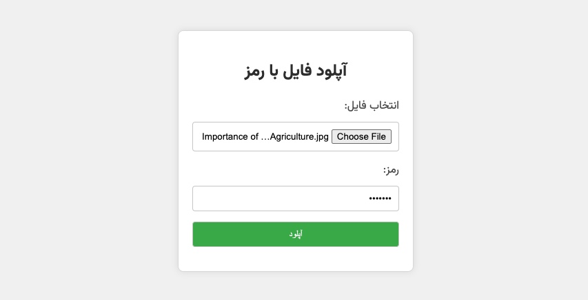

# آپلود فایل با PHP و HTML

## نویسنده
- **نام:** حمیدرضا درهمی
- **وبسایت:** [hawid.ir](https://hawid.ir)
- **ایدی گیت‌هاب:** [derhami](https://github.com/derhami)

## توضیحات
این پروژه یک وبسایت ساده برای آپلود فایل با استفاده از PHP و HTML می‌باشد. در این وبسایت، کاربران می‌توانند فایل‌های خود را با افزودن یک رمز اختصاصی آپلود کرده و لینک دانلود را دریافت نمایند.

## ویژگی‌ها
- آپلود فایل با رمز اختصاصی.
- نمایش پیام‌های آپلود موفق یا ناموفق.
- ایجاد لینک دانلود برای فایل آپلود شده.

## نحوه استفاده
1. دانلود کد از گیت‌هاب.
2. آپلود کد به سرور وب خود.
3. تنظیم مسیر ذخیره فایل و رمز آپلود در `upload.php`.
4. اجرای صفحه `index.html` در مرورگر.

## نیازمندی‌ها
- PHP 5.6 یا نسخه‌های بالاتر.
- یک سرور وب مانند Apache یا Nginx.

## موارد اضافی
- این کد به صورت ساده طراحی شده و بهینه نشده است. می‌توانید بهبودهای لازم را اعمال کنید.
- هنگام استفاده از این کد در محیط تولیدی، از افزودن لایه‌های امنیتی مانند HTTPS برای افزایش امنیت استفاده کنید.
